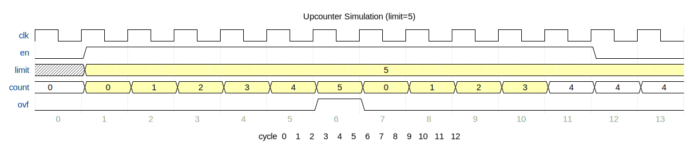

# Upcounter Simulation Walkthrough

This walkthrough demonstrates how to simulate the upcounter design using Amaranth's built-in simulator and inspect its behavior.

## The design

The upcounter (`upcounter/design/design.py`) is a simple 8-bit counter with four signals:

| Signal | Direction | Width | Description |
|--------|-----------|-------|-------------|
| `limit` | input | 8 | Count limit — counter overflows when it reaches this value |
| `en` | input | 1 | Enable — counter only advances when high |
| `ovf` | output | 1 | Overflow flag — high for one cycle when count equals limit |
| `count` | output | 8 | Current counter value |

### Behavior

- On each clock cycle, if `en` is high, `count` increments by 1.
- When `count` reaches `limit`, the `ovf` flag goes high and `count` resets to 0 on the next cycle.
- When `en` is low, `count` holds its current value.

## Writing a testbench

Create a test file at `upcounter/design/test_upcounter.py`:

```python
"""Simulation testbench for the upcounter design."""

from amaranth.sim import Simulator
from design import UpCounter


dut = UpCounter()
sim = Simulator(dut)
sim.add_clock(1e-6)  # 1 MHz clock


async def testbench(ctx):
    # Set limit to 5 and enable the counter
    ctx.set(dut.pins.limit.i, 5)
    ctx.set(dut.pins.en.i, 1)

    # Run for 10 clock cycles and observe
    for cycle in range(10):
        count = ctx.get(dut.pins.count.o)
        ovf = ctx.get(dut.pins.ovf.o)
        print(f"cycle {cycle:2d}:  count={count}  ovf={ovf}")
        await ctx.tick()

    # Disable counter and run a few more cycles
    ctx.set(dut.pins.en.i, 0)
    print("-- counter disabled --")

    for cycle in range(10, 13):
        count = ctx.get(dut.pins.count.o)
        ovf = ctx.get(dut.pins.ovf.o)
        print(f"cycle {cycle:2d}:  count={count}  ovf={ovf}")
        await ctx.tick()


sim.add_testbench(testbench)

with sim.write_vcd("upcounter.vcd"):
    sim.run()

print("\nWrote upcounter.vcd — open with GTKWave or Surfer to view waveforms.")
```

### Key concepts

- **`Simulator(dut)`** — wraps the design for simulation.
- **`add_clock(1e-6)`** — adds a 1 MHz clock to the default `sync` domain.
- **`add_testbench(fn)`** — registers an async function that drives inputs and checks outputs.
- **`ctx.set(signal, value)`** — drives an input signal.
- **`ctx.get(signal)`** — reads a signal's current value.
- **`await ctx.tick()`** — advances one clock cycle.
- **`write_vcd("file.vcd")`** — captures all signals to a VCD file for waveform viewing.

## Running the simulation

```bash
cd upcounter/design
PYTHONPATH=$PYTHONPATH:../../ uv run python test_upcounter.py
```

### Output

```
cycle  0:  count=0  ovf=0
cycle  1:  count=1  ovf=0
cycle  2:  count=2  ovf=0
cycle  3:  count=3  ovf=0
cycle  4:  count=4  ovf=0
cycle  5:  count=5  ovf=1
cycle  6:  count=0  ovf=0
cycle  7:  count=1  ovf=0
cycle  8:  count=2  ovf=0
cycle  9:  count=3  ovf=0
-- counter disabled --
cycle 10:  count=4  ovf=0
cycle 11:  count=4  ovf=0
cycle 12:  count=4  ovf=0
```

## Waveform

The simulation produces this timing diagram (with `limit=5`):



**What's happening:**

1. **Cycles 0–4** — counter increments each cycle: 0, 1, 2, 3, 4.
2. **Cycle 5** — count reaches `limit` (5), so `ovf` goes high.
3. **Cycle 6** — count resets to 0, `ovf` goes low, counting resumes.
4. **Cycles 7–9** — counter continues: 1, 2, 3.
5. **Cycle 10** — `en` goes low. Count holds at 4.
6. **Cycles 11–12** — count remains frozen at 4 while disabled.

## Viewing waveforms

The simulation writes `upcounter.vcd`, which you can open with a waveform viewer:

- **[Surfer](https://surfer-project.org/)** — modern, cross-platform waveform viewer
- **[GTKWave](https://gtkwave.github.io/gtkwave/)** — classic VCD viewer

```bash
# Open with Surfer
surfer upcounter.vcd

# Open with GTKWave
gtkwave upcounter.vcd
```

## Next steps

- Try changing `limit` to different values and observe the behavior.
- Add assertions to the testbench to make it a proper automated test:

  ```python
  count = ctx.get(dut.pins.count.o)
  assert count == expected, f"Expected {expected}, got {count}"
  ```

- See the [Simulation](simulation.md) guide for ChipFlow's CXXRTL-based simulation platform, which supports full SoC designs with peripheral models.
